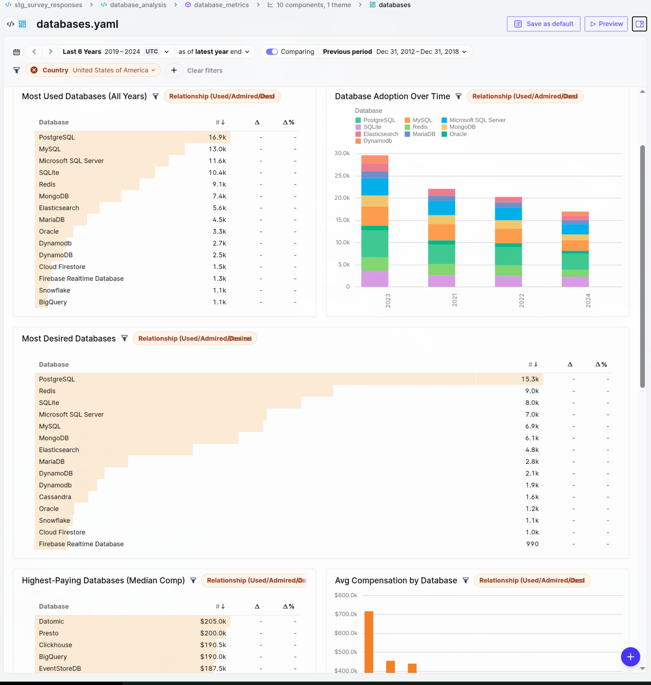

# MotherDuck + Rill: Stack Overflow Developer Survey

Companion repo for **[MotherDuck & Rill: Agentic Workflows for BI](https://sspaeti.com/blog/motherduck-rill-agentic-workflows-bi/)**. Clone, set one env var, run `make` — enterprise-grade analytics in minutes.

Analyzes **600k+ professional developer responses** from the 2019–2024 Stack Overflow surveys using data already available in every free MotherDuck account (`sample_data.stackoverflow_survey`). Zero data pipeline needed.



## Quick Start

```bash
# 1. Clone
git clone https://github.com/sspaeti/motherduck-rill.git
cd motherduck-rill

# 2. Configure (get a free token at https://motherduck.com → Settings → Access Tokens)
cp .env.example .env
# Edit .env → set connector.motherduck.token=your_token

# 3. Run
make
```

Open [http://localhost:9009](http://localhost:9009) and explore.

## What You Get

**3 Canvas Dashboards**
- **Survey Overview** — KPIs, top languages/databases/editors/OSes, compensation by experience, remote work, AI adoption (2023-2024)
- **Technology Trends** — Language & database adoption over time, editor wars, web frameworks, data engineer growth, job satisfaction
- **Databases** — Used/desired databases, compensation by database, data engineers vs non-DEs, market share

**3 Interactive Explores**
- Technology Landscape, Developer Insights, Database Explorer

## Architecture

```
motherduck-rill/
├── rill.yaml                          # Project config (olap_connector: motherduck)
├── Makefile                           # make → rill start
├── connectors/
│   └── motherduck.yaml                # MotherDuck connection (DuckDB driver)
├── models/
│   ├── stg_survey_responses.sql       # Staging: clean, cast, filter 2019-2024 pros
│   ├── technology_usage.sql           # Unnest: one row per respondent × tech
│   ├── developer_profiles.sql         # Profiles: one row per employed dev
│   └── database_analysis.sql          # Databases: used / admired / desired
├── metrics/
│   ├── survey_metrics.yaml            # Compensation, remote %, AI, demographics
│   ├── technology_metrics.yaml        # Tech adoption, comp by technology
│   └── database_metrics.yaml          # Database usage, admired/desired
├── canvases/
│   ├── survey_overview.yaml           # Executive overview canvas
│   ├── technology_trends.yaml         # Technology deep dive canvas
│   └── databases.yaml                 # Database deep dive canvas
├── explores/
│   ├── technology_landscape.yaml      # Interactive tech pivot
│   ├── developer_insights.yaml        # Interactive workforce pivot
│   └── database_explore.yaml          # Interactive database pivot
└── theme.yaml                         # Stack Overflow brand colors
```

## Design Decisions

- **Pure SQL + YAML** — No Python, no dlt, no orchestrator. BI-as-code at its most minimal.
- **MotherDuck sample_data** — Every free account ships with the Stack Overflow survey. Zero ingestion.
- **2019–2024 professionals** — `MainBranch = 'I am a developer by profession'` (2017-2018 lack this column).
- **Two grains** — `developer_profiles` (1 row/person) for comp stats; `technology_usage` (1 row/person/tech) for adoption metrics.
- **NA → NULL** — The survey uses string `"NA"` for missing values; staging model converts them to proper NULLs.

## Requirements

- [Rill](https://docs.rilldata.com/install) (v0.50+)
- Free [MotherDuck](https://motherduck.com/docs/key-tasks/authenticating-and-connecting-to-motherduck/authenticating-to-motherduck/) account

## Deploy to Rill Cloud

```bash
rill deploy
```
